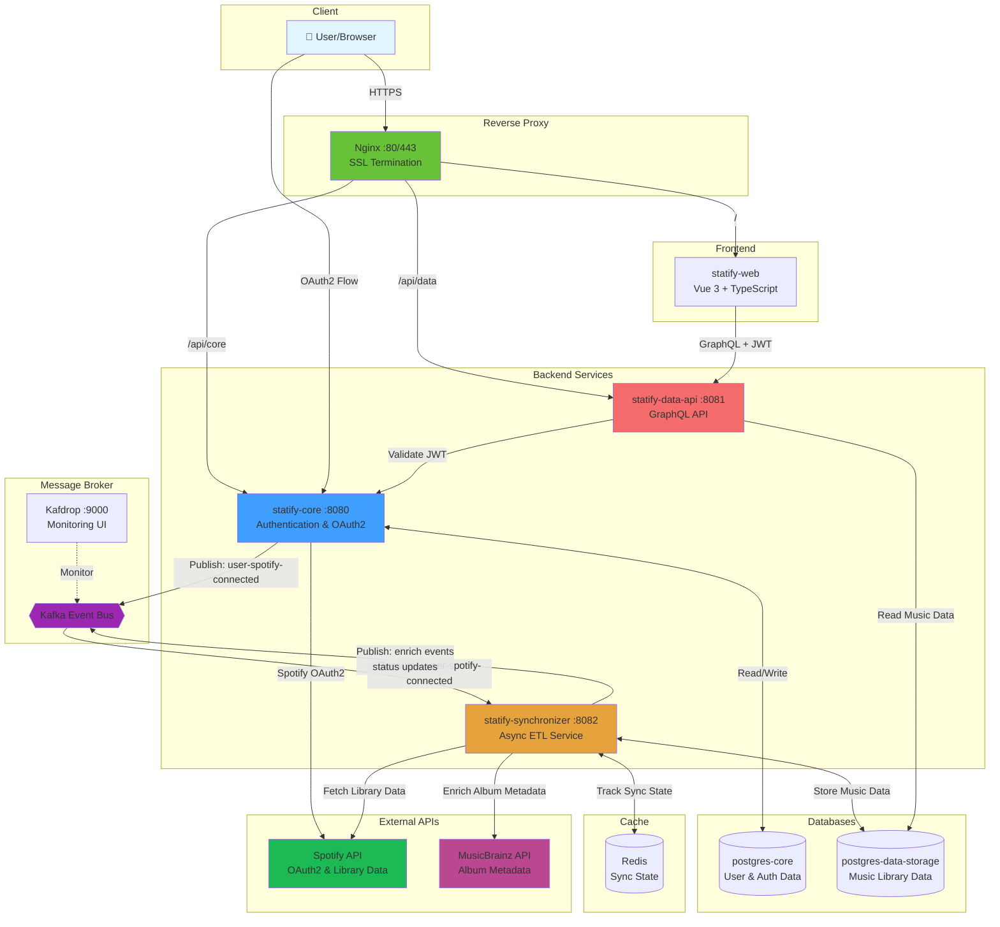

# Statify

Statify is a microservices-based platform for syncing, storing, and analyzing Spotify user data. Built with Kotlin, Spring Boot, Vue 3, and deployed via Docker Compose.

## Architecture

### Backend Services

| Service | Port | Description | Technology Stack |
|---------|------|-------------|-----------------|
| **statify-core** | 8080 | Authentication service with Spotify OAuth2 and JWT | Spring Boot, PostgreSQL, Kafka |
| **statify-synchronizer** | 8082 | Async ETL service for fetching and storing Spotify data | Spring WebFlux, PostgreSQL, Redis, Kafka |
| **statify-data-api** | 8081 | GraphQL API for querying user's music library and analytics | Spring Boot, GraphQL, PostgreSQL |
| **statify-web** | - | Vue 3 frontend with Apollo GraphQL client | Vue 3, TypeScript, Tailwind CSS, Vite |

### Infrastructure

- **PostgreSQL** (2 databases)
  - `postgres-core:5432` - Authentication and user data
  - `postgres-data-storage:5432` - Spotify library and analytics data
- **Kafka** - Message broker for inter-service communication
- **Redis** - Caching and synchronization state
- **Kafdrop** (9000) - Kafka topics monitoring UI
- **Nginx** (80/443) - Reverse proxy and static file server

### System Architecture Diagram



### Key Data Flows

1. **Authentication Flow:**
   - User → Nginx → Core (OAuth2) → Spotify → Core → Kafka (`user-spotify-connected`)

2. **Synchronization Flow:**
   - Kafka → Synchronizer → Spotify API (fetch library)
   - Synchronizer → MusicBrainz API (enrich albums)
   - Synchronizer → PostgreSQL (data-storage-db) + Redis
   - Synchronizer → Kafka (status updates)

3. **GraphQL Query Flow:**
   - User → Nginx → Data API (with JWT) → PostgreSQL (read-only)

### Kafka Topics

| Topic | Producer | Consumer | Payload |
|-------|----------|----------|---------|
| `user-spotify-connected` | statify-core | statify-synchronizer | User OAuth2 success event |
| `track-enrich`, `album-enrich`, `artist-enrich` | statify-synchronizer | statify-synchronizer | Entity enrichment requests |
| `album-rg-lookup-by-barcode`, `album-rg-lookup-by-name` | statify-synchronizer | statify-synchronizer | MusicBrainz lookup requests |
| `user-spotify-library-status-updated` | statify-synchronizer | - | Sync status updates |

## Prerequisites

- Docker and Docker Compose
- Spotify Developer Account ([create app](https://developer.spotify.com/dashboard))

## Quick Start

1. **Clone the repository**
   ```bash
   git clone <repository-url>
   cd statify
   ```

2. **Configure environment variables**
   ```bash
   cp .env.example .env
   ```

   Edit `.env` and set:
   - `SPOTIFY_CLIENT_ID` and `SPOTIFY_CLIENT_SECRET` from your Spotify Developer Dashboard
   - `JWT_ACCESS_SECRET_KEY` and `JWT_REFRESH_SECRET_KEY` (generate random strings ≥32 chars)
   - `ENCRYPTION_PASSWORD` and `ENCRYPTION_SALT` (generate strong random values)
   - Database and Redis passwords (change defaults for production)

3. **Start the stack**
   ```bash
   docker-compose up --build
   ```

4. **Access the application**
   - Frontend: https://localhost
   - Kafdrop (Kafka UI): http://localhost:9000
   - GraphQL Playground: https://localhost/api/data/graphiql

## Development

### Project Structure

```
statify/
├── statify-core/          # Authentication service (Spring Boot)
├── statify-synchronizer/  # Data synchronization service (WebFlux)
├── statify-data-api/      # GraphQL API (Spring Boot + GraphQL DGS)
├── statify-utils/         # Shared utilities and common code
├── statify-web/           # Vue 3 frontend
├── nginx/                 # Nginx configuration files
├── docker-compose.yaml    # Production orchestration
├── docker-compose.local.yaml # Local development setup
└── .env.example           # Environment variables template
```

### Running Individual Services Locally

Each service has its own `.env.example` and can be run independently:

```bash
# Backend services (from module directory)
./gradlew bootRun --args='--spring.profiles.active=local'

# Frontend (from statify-web/)
npm install
npm run dev
```

**Note:** For local development, configure `.env` with `*_LOCAL_*` URL variants and ensure PostgreSQL, Kafka, and Redis are running.

### Building Frontend

The frontend must be built before running the full Docker stack:

```bash
cd statify-web
npm install
npm run build
```

The build output (`dist/`) is copied into the Nginx container.

## Configuration

### Environment Files

- **Root `.env`** - Used by `docker-compose.yaml` for all services
- **`statify-web/.env`** - Frontend API endpoints

Individual service `.env.example` files exist for reference but aren't used in Docker Compose mode.

### SSL Certificates

For HTTPS in Docker, place SSL certificates in `nginx/certs/`:
- `localhost+2.pem`
- `localhost+2-key.pem`

You can generate local certificates with [mkcert](https://github.com/FiloSottile/mkcert):
```bash
mkcert -install
mkcert localhost 127.0.0.1 ::1
mv localhost+2*.pem nginx/certs/
```

## Monitoring

- **Kafdrop**: http://localhost:9000 - Monitor Kafka topics and messages
- **Health checks**:
  - https://localhost/api/core/actuator/health
  - https://localhost/api/data/actuator/health

## Technology Stack

### Backend
- **Kotlin** - Primary programming language
- **Spring Boot 3** - Application framework
- **Spring WebFlux** - Reactive programming (synchronizer)
- **GraphQL DGS** - GraphQL server implementation
- **PostgreSQL 16** - Relational database with pg_cron extension
- **Kafka 3.7** - Event streaming platform
- **Redis 7** - In-memory cache

### Frontend
- **Vue 3** - Progressive JavaScript framework
- **TypeScript** - Type-safe JavaScript
- **Vite** - Build tool and dev server
- **Tailwind CSS** - Utility-first CSS framework
- **Apollo Client** - GraphQL client
- **Pinia** - State management

### DevOps
- **Gradle** - Build automation
- **Docker & Docker Compose** - Containerization
- **Nginx** - Reverse proxy and static file server

## API Authentication

statify-core handles authentication via Spotify OAuth2 and issues JWT tokens:

1. User initiates login → Redirected to Spotify OAuth
2. Callback received → statify-core issues access + refresh JWTs
3. Tokens stored in HTTP-only cookies
4. statify-data-api validates JWT for protected GraphQL queries

## Data Synchronization Flow

1. User authenticates via statify-core
2. OAuth success → Event published to Kafka
3. statify-synchronizer consumes event
4. Fetches user's library from Spotify API (tracks, artists, albums)
5. Enriches metadata via MusicBrainz API
6. Stores in PostgreSQL (postgres-data-storage)
7. Caches intermediate state in Redis
8. statify-data-api exposes data via GraphQL
